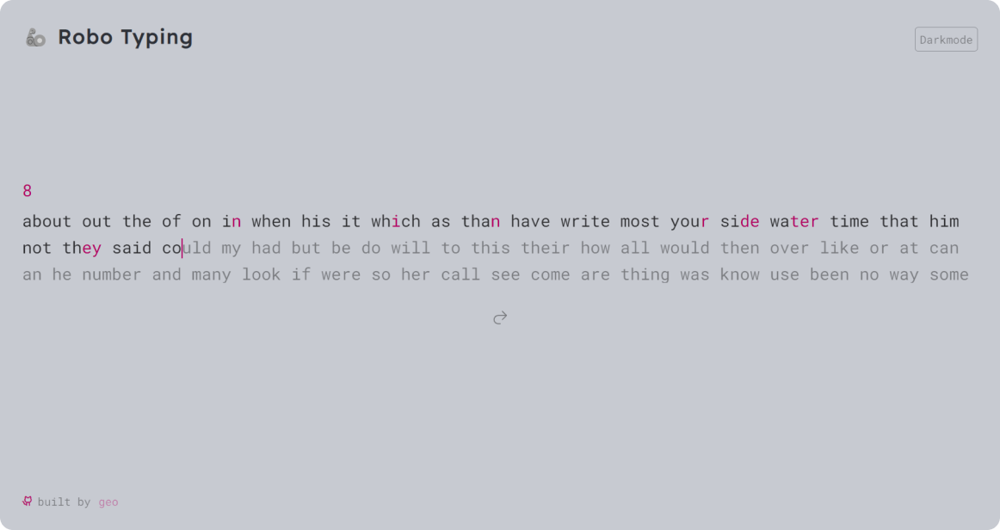

# 🦾 Robo Typing

> **[Robo Typing](https://typing-dusky-three.vercel.app/)** is a game that measures your typing speed similar to **[Monkeytype](https://monkeytype.com/)** and it's based on tutorial by **[joyofcode](https://joyofcode.xyz/svelte-typing-game)** (**[@mattcroat](https://github.com/mattcroat)**).

<p align="left" width="100%">
    <a href="https://typing-dusky-three.vercel.app/"></a><br>
       🚀 <a href="https://typing-dusky-three.vercel.app/">See deployment</a>
</p>

### Installation

```sh
git clone https://github.com/GeoGeorgeous/typing.git typing && cd typing && npm i && npm run dev
```

### Built With

- `SvelteKit`
- `SASS`
- `TypeScript`

### Todos:

- [x] The caret should animate when it moves to the next word
- [x] User can start a game on accident by pressing any key - make sure the input is a letter
- [x] Light / Dark themes
- [ ] Break the code into components (you can use Svelte component events and I wrote a Svelte state management guide if you need help)
- [ ] The input can lose focus if you press a random key, so make sure you keep track of the focus and improve that experience for the player
- [ ] Figure out how to edit previous letters for the current word by listening for the Backspace key and changing letterIndex
- [ ] Many languages support
