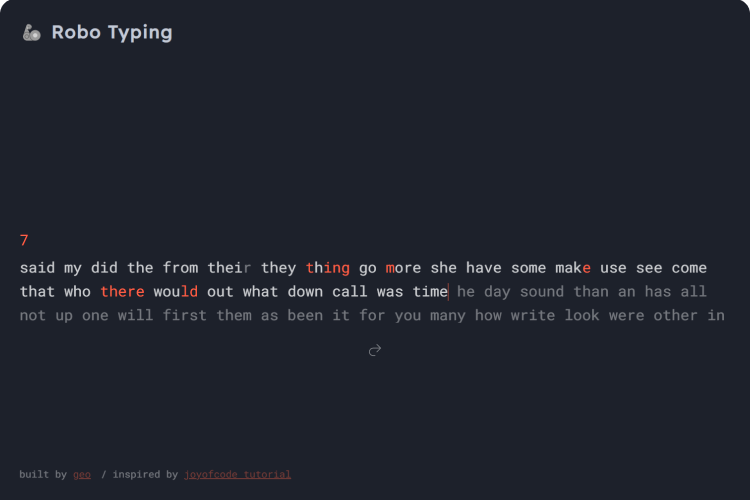

<p align="center" width="100%">
    <a href="https://typing-dusky-three.vercel.app/"></a><br>
       🚀 <a href="https://geogeorgeous.github.io/mesto/">See deployment</a>
</p>

# 🦾 Robo Typing

### About the project

**[🦾 Robo Typing](https://typing-dusky-three.vercel.app/)** is a game that measures your typing speed similar to [Monkeytype](https://monkeytype.com/) and it's based on tutorial by [joyofcode](https://joyofcode.xyz/svelte-typing-game).

### Installation

```sh
git clone https://github.com/GeoGeorgeous/typing.git typing && cd typing && npm i && npm run dev
```

### Built With

- SvelteKit
- SASS

### Roadmap

- [ ] Break the code into components (you can use Svelte component events and I wrote a Svelte state management guide if you need help)
- [ ] The input can lose focus if you press a random key, so make sure you keep track of the focus and improve that experience for the player
- [ ] You can start a game on accident by pressing any key but you could use regex to make sure the input is a letter
- [ ] Figure out how to edit previous letters for the current word by listening for the Backspace key and changing letterIndex
- [x] The caret should animate when it moves to the next word and you can fix it by adding a space between words which would count towards the score, so you could remove the Space code
- [ ] Many languages support
